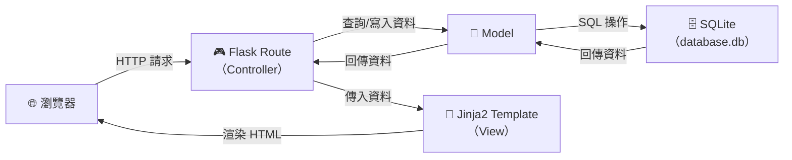
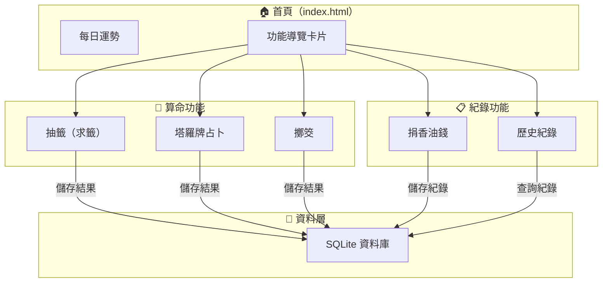
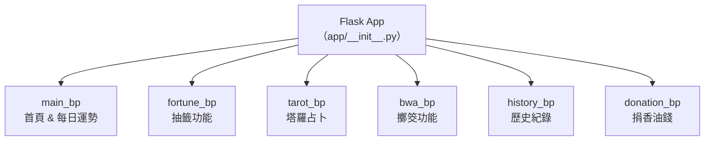

# 線上算命系統 — 系統架構文件

> **版本：** v1.0
> **建立日期：** 2026-04-09
> **狀態：** 草稿
> **依據：** [PRD v1.0](./PRD.md)

---

## 目錄

- [1. 技術架構說明](#1-技術架構說明)
- [2. 專案資料夾結構](#2-專案資料夾結構)
- [3. 元件關係圖](#3-元件關係圖)
- [4. 關鍵設計決策](#4-關鍵設計決策)

---

## 1. 技術架構說明

### 1.1 選用技術與原因

| 技術 | 用途 | 選用原因 |
|------|------|----------|
| **Python 3** | 程式語言 | 語法簡潔易學，生態系豐富，適合快速開發 Web 應用 |
| **Flask** | 後端框架 | 輕量級微框架，彈性高，學習曲線平緩，適合中小型專案 |
| **Jinja2** | 模板引擎 | Flask 內建支援，可直接在 HTML 中嵌入 Python 邏輯，實現伺服器端渲染（SSR） |
| **SQLite** | 資料庫 | 無需額外安裝伺服器，以檔案形式存放，適合開發與練習環境 |
| **HTML + CSS + JavaScript** | 前端 | 標準 Web 技術，搭配 Jinja2 模板實現頁面渲染與互動效果 |

### 1.2 MVC 架構模式說明

本系統採用 **MVC（Model–View–Controller）** 架構模式，將程式邏輯分為三個層次，各司其職：

```
┌─────────────────────────────────────────────────────────┐
│                      使用者（瀏覽器）                     │
└──────────────────────┬──────────────────────────────────┘
                       │ HTTP 請求
                       ▼
┌─────────────────────────────────────────────────────────┐
│              Controller（Flask Routes）                  │
│                                                         │
│  • 接收使用者的 HTTP 請求（GET / POST）                    │
│  • 呼叫 Model 存取資料                                   │
│  • 決定要回傳哪個 View（模板）                             │
│  • 處理業務邏輯（隨機抽籤、擲筊結果判定等）                 │
└────────┬───────────────────────────────┬────────────────┘
         │                               │
         ▼                               ▼
┌──────────────────┐          ┌──────────────────────────┐
│  Model（資料層）  │          │   View（Jinja2 模板）     │
│                  │          │                          │
│ • 定義資料表結構  │          │ • HTML 頁面模板           │
│ • 資料庫 CRUD    │          │ • 接收 Controller 傳入    │
│ • 資料驗證       │          │   的資料並渲染成 HTML      │
│ • 與 SQLite 互動 │          │ • 包含 CSS 樣式與 JS 互動 │
└──────────────────┘          └──────────────────────────┘
```

**簡單來說：**

| 層次 | 對應資料夾 | 負責什麼 | 範例 |
|------|-----------|---------|------|
| **Model** | `app/models/` | 定義資料結構、存取資料庫 | 籤詩資料表、歷史紀錄 CRUD |
| **View** | `app/templates/` | 呈現畫面給使用者 | 首頁 HTML、抽籤結果頁面 |
| **Controller** | `app/routes/` | 處理請求、控制流程 | 處理抽籤邏輯、儲存結果 |

---

## 2. 專案資料夾結構

```
321/
├── app.py                     # 應用程式入口，建立並啟動 Flask app
├── config.py                  # 設定檔（資料庫路徑、密鑰等）
├── requirements.txt           # Python 套件依賴清單
│
├── app/                       # 主要應用程式目錄
│   ├── __init__.py            # Flask app 工廠函式（create_app）
│   │
│   ├── models/                # Model 層 — 資料庫模型
│   │   ├── __init__.py
│   │   ├── fortune.py         # 籤詩資料模型（籤詩內容、等級、類別）
│   │   ├── tarot.py           # 塔羅牌資料模型（牌面、正逆位含義）
│   │   ├── history.py         # 歷史紀錄模型（使用者的算命紀錄）
│   │   └── donation.py        # 捐款紀錄模型（香油錢紀錄）
│   │
│   ├── routes/                # Controller 層 — Flask 路由
│   │   ├── __init__.py
│   │   ├── main.py            # 首頁、每日運勢等主要路由
│   │   ├── fortune.py         # 抽籤相關路由
│   │   ├── tarot.py           # 塔羅牌占卜相關路由
│   │   ├── bwa.py             # 擲筊相關路由（bwa = 筊）
│   │   ├── history.py         # 歷史紀錄查看路由
│   │   └── donation.py        # 捐香油錢相關路由
│   │
│   ├── templates/             # View 層 — Jinja2 HTML 模板
│   │   ├── base.html          # 基礎模板（共用的 header、footer、導覽列）
│   │   ├── index.html         # 首頁（每日運勢 + 算命方式導覽卡片）
│   │   ├── fortune/
│   │   │   ├── draw.html      # 抽籤頁面（選擇類別、搖籤筒）
│   │   │   └── result.html    # 籤詩結果頁面
│   │   ├── tarot/
│   │   │   ├── select.html    # 塔羅占卜 — 選擇主題與牌陣
│   │   │   └── result.html    # 塔羅占卜 — 翻牌與解讀
│   │   ├── bwa/
│   │   │   ├── throw.html     # 擲筊頁面（輸入問題、擲筊按鈕）
│   │   │   └── result.html    # 擲筊結果頁面
│   │   ├── history/
│   │   │   └── index.html     # 歷史紀錄列表頁面
│   │   └── donation/
│   │       ├── index.html     # 捐香油錢頁面
│   │       └── thanks.html    # 捐款感謝頁面
│   │
│   └── static/                # 靜態資源
│       ├── css/
│       │   └── style.css      # 全站樣式表（深色神秘風格）
│       ├── js/
│       │   └── main.js        # 全站 JavaScript（動畫、互動效果）
│       └── images/
│           ├── tarot/         # 塔羅牌圖片
│           ├── fortune/       # 籤筒、籤詩相關圖片
│           └── icons/         # 功能圖示與 UI 圖示
│
├── instance/                  # Flask 實例目錄（不進版控）
│   └── database.db            # SQLite 資料庫檔案
│
├── docs/                      # 專案文件
│   ├── PRD.md                 # 產品需求文件
│   └── ARCHITECTURE.md        # 系統架構文件（本文件）
│
└── .gitignore                 # Git 忽略規則
```

### 各資料夾用途速查

| 資料夾 / 檔案 | 用途 |
|---------------|------|
| `app.py` | 程式入口點，負責建立 Flask app 並啟動伺服器 |
| `config.py` | 集中管理設定（資料庫路徑、SECRET_KEY 等） |
| `app/__init__.py` | Flask 應用工廠，初始化資料庫、註冊 Blueprint |
| `app/models/` | 所有資料庫模型，負責資料的結構定義與存取 |
| `app/routes/` | 所有路由（Controller），每個功能一個檔案，用 Blueprint 組織 |
| `app/templates/` | 所有 HTML 模板，用子資料夾區分不同功能的頁面 |
| `app/static/` | CSS、JavaScript、圖片等靜態資源 |
| `instance/` | SQLite 資料庫存放位置，不納入版本控制 |
| `docs/` | 專案設計文件 |

---

## 3. 元件關係圖

### 3.1 請求處理流程



### 3.2 功能模組關係圖



### 3.3 Flask Blueprint 架構



---

## 4. 關鍵設計決策

### 決策一：使用 Flask Application Factory 模式

**選擇：** 使用 `create_app()` 工廠函式來建立 Flask 應用程式實例

**原因：**
- 方便管理不同環境的設定（開發、測試、上線）
- 避免循環引入問題（circular import）
- 未來如果需要寫測試，可以輕鬆建立獨立的測試用 app 實例

**做法：** 在 `app/__init__.py` 中定義 `create_app()` 函式，統一初始化資料庫連線、註冊所有 Blueprint。

---

### 決策二：使用 Blueprint 組織路由

**選擇：** 每個功能模組使用獨立的 Flask Blueprint

**原因：**
- 系統包含 6 個以上的功能模組，若全部寫在同一個檔案會難以維護
- Blueprint 可以為每個模組定義獨立的 URL 前綴（如 `/fortune/`、`/tarot/`）
- 各模組可以獨立開發與測試，適合多人協作

**做法：** `app/routes/` 下每個檔案定義一個 Blueprint，在 `create_app()` 中統一註冊。

---

### 決策三：使用 SQLite 搭配原生 sqlite3 模組

**選擇：** 使用 Python 內建的 `sqlite3` 模組直接操作資料庫，而非 ORM（如 SQLAlchemy）

**原因：**
- 專案規模適中，SQL 語法直觀易學，適合初學者理解資料庫操作
- 減少額外套件依賴，降低環境設定的複雜度
- 直接撰寫 SQL 有助於學習資料庫基礎知識

**做法：** 在 `app/models/` 中封裝資料庫操作函式，統一管理 SQL 語句，避免在 route 中直接寫 SQL。

---

### 決策四：伺服器端渲染（SSR）而非前後端分離

**選擇：** 使用 Flask + Jinja2 進行伺服器端渲染，不採用前後端分離架構

**原因：**
- 減少技術複雜度，不需要額外學習前端框架（如 React、Vue）
- 所有頁面由 Flask 統一處理，開發流程簡單直接
- Jinja2 模板繼承機制可有效重用共用版面（header、footer、導覽列）

**做法：** 使用 `base.html` 作為基礎模板，各功能頁面透過 `` 繼承共用結構。

---

### 決策五：靜態資源與動畫效果的處理策略

**選擇：** 使用原生 CSS 動畫 + Vanilla JavaScript 實現互動效果

**原因：**
- 不引入前端框架或動畫庫，保持技術棧的簡潔
- CSS `@keyframes` 動畫效能佳，適合搖籤筒、筊杯翻轉等視覺效果
- Vanilla JS 足以處理翻牌互動、按鈕事件等需求

**做法：** 在 `static/css/style.css` 中定義動畫樣式，在 `static/js/main.js` 中處理事件綁定與動態效果。

---

> 📌 **下一步：** 架構確認無誤後，進入 **階段三：流程圖設計**（使用 `/flowchart` skill）。
