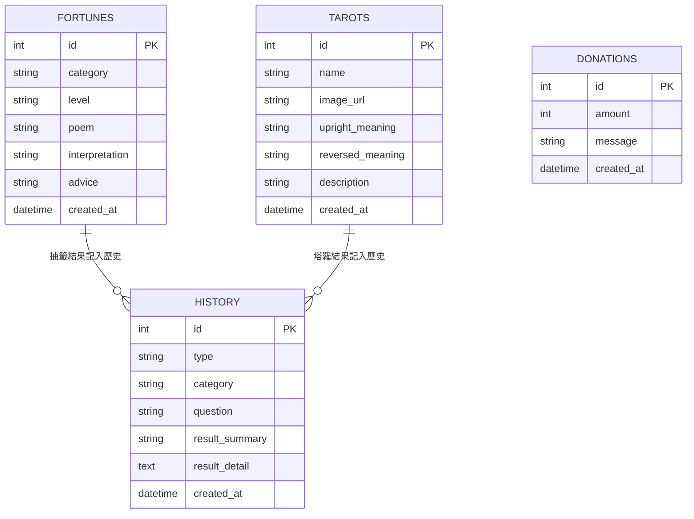

# 線上算命系統 — 資料庫設計文件

> **版本：** v1.0
> **建立日期：** 2026-04-19
> **狀態：** 草稿
> **依據：** [PRD v1.0](./PRD.md) ／ [ARCHITECTURE v1.0](./ARCHITECTURE.md) ／ [FLOWCHART v1.0](./FLOWCHART.md)

---

## 目錄

- [1. ER 圖（實體關係圖）](#1-er-圖實體關係圖)
- [2. 資料表詳細說明](#2-資料表詳細說明)
- [3. SQL 建表語法](#3-sql-建表語法)
- [4. Python Model 對照表](#4-python-model-對照表)

---

## 1. ER 圖（實體關係圖）



### 關聯說明

| 關聯 | 說明 |
|------|------|
| FORTUNES → HISTORY | 每次抽籤的結果會新增一筆 HISTORY 紀錄，`type = 'fortune'` |
| TAROTS → HISTORY | 每次塔羅占卜的結果會新增一筆 HISTORY 紀錄，`type = 'tarot'` |
| 擲筊 → HISTORY | 擲筊結果直接新增 HISTORY 紀錄，`type = 'bwa'`，不需要額外資料表 |
| DONATIONS | 獨立資料表，記錄每筆捐款，不與 HISTORY 關聯 |

---

## 2. 資料表詳細說明

### 2.1 籤詩資料表（fortunes）

> 儲存所有籤詩的內容，作為抽籤時的資料來源（種子資料）。

| 欄位 | 型別 | 必填 | 說明 |
|------|------|------|------|
| `id` | INTEGER | ✅ | 主鍵，自動遞增 |
| `category` | TEXT | ✅ | 籤詩類別（綜合運勢、感情、事業、學業、財運、健康） |
| `level` | TEXT | ✅ | 籤等級（上上籤、上籤、中籤、下籤、下下籤） |
| `poem` | TEXT | ✅ | 籤詩原文（古詩形式） |
| `interpretation` | TEXT | ✅ | 白話解釋 |
| `advice` | TEXT | ✅ | 建議與指引 |
| `created_at` | TEXT | ✅ | 建立時間（ISO 8601 格式） |

### 2.2 塔羅牌資料表（tarots）

> 儲存所有塔羅牌的基本資訊，作為占卜時的資料來源（種子資料）。

| 欄位 | 型別 | 必填 | 說明 |
|------|------|------|------|
| `id` | INTEGER | ✅ | 主鍵，自動遞增 |
| `name` | TEXT | ✅ | 牌名（如：愚者、魔術師、女祭司…） |
| `image_url` | TEXT | ✅ | 牌面圖片路徑 |
| `upright_meaning` | TEXT | ✅ | 正位含義 |
| `reversed_meaning` | TEXT | ✅ | 逆位含義 |
| `description` | TEXT | ✅ | 牌面描述與象徵意義 |
| `created_at` | TEXT | ✅ | 建立時間（ISO 8601 格式） |

### 2.3 歷史紀錄資料表（history）

> 儲存使用者每次算命的結果紀錄，統一記錄抽籤、塔羅、擲筊三種類型。

| 欄位 | 型別 | 必填 | 說明 |
|------|------|------|------|
| `id` | INTEGER | ✅ | 主鍵，自動遞增 |
| `type` | TEXT | ✅ | 算命類型（`fortune` = 抽籤、`tarot` = 塔羅、`bwa` = 擲筊） |
| `category` | TEXT | ❌ | 類別（抽籤的類別或塔羅的主題，擲筊不使用） |
| `question` | TEXT | ❌ | 使用者的問題（擲筊時使用） |
| `result_summary` | TEXT | ✅ | 結果摘要（如「上上籤」、「聖筊」、牌名） |
| `result_detail` | TEXT | ✅ | 結果詳細內容（JSON 格式，儲存完整的籤詩或牌面資訊） |
| `created_at` | TEXT | ✅ | 建立時間（ISO 8601 格式） |

### 2.4 捐款紀錄資料表（donations）

> 儲存每筆模擬捐款的紀錄。

| 欄位 | 型別 | 必填 | 說明 |
|------|------|------|------|
| `id` | INTEGER | ✅ | 主鍵，自動遞增 |
| `amount` | INTEGER | ✅ | 捐款金額（單位：元） |
| `message` | TEXT | ❌ | 捐款者的祈願留言 |
| `created_at` | TEXT | ✅ | 建立時間（ISO 8601 格式） |

---

## 3. SQL 建表語法

> 完整的 SQL 建表語法請參考 [`database/schema.sql`](../database/schema.sql)。

```sql
-- 籤詩資料表
CREATE TABLE IF NOT EXISTS fortunes (
    id INTEGER PRIMARY KEY AUTOINCREMENT,
    category TEXT NOT NULL,
    level TEXT NOT NULL,
    poem TEXT NOT NULL,
    interpretation TEXT NOT NULL,
    advice TEXT NOT NULL,
    created_at TEXT NOT NULL DEFAULT (datetime('now', 'localtime'))
);

-- 塔羅牌資料表
CREATE TABLE IF NOT EXISTS tarots (
    id INTEGER PRIMARY KEY AUTOINCREMENT,
    name TEXT NOT NULL,
    image_url TEXT NOT NULL,
    upright_meaning TEXT NOT NULL,
    reversed_meaning TEXT NOT NULL,
    description TEXT NOT NULL,
    created_at TEXT NOT NULL DEFAULT (datetime('now', 'localtime'))
);

-- 歷史紀錄資料表
CREATE TABLE IF NOT EXISTS history (
    id INTEGER PRIMARY KEY AUTOINCREMENT,
    type TEXT NOT NULL CHECK (type IN ('fortune', 'tarot', 'bwa')),
    category TEXT,
    question TEXT,
    result_summary TEXT NOT NULL,
    result_detail TEXT NOT NULL,
    created_at TEXT NOT NULL DEFAULT (datetime('now', 'localtime'))
);

-- 捐款紀錄資料表
CREATE TABLE IF NOT EXISTS donations (
    id INTEGER PRIMARY KEY AUTOINCREMENT,
    amount INTEGER NOT NULL CHECK (amount > 0),
    message TEXT DEFAULT '',
    created_at TEXT NOT NULL DEFAULT (datetime('now', 'localtime'))
);

-- 索引：加速歷史紀錄的查詢與篩選
CREATE INDEX IF NOT EXISTS idx_history_type ON history (type);
CREATE INDEX IF NOT EXISTS idx_history_created_at ON history (created_at);
CREATE INDEX IF NOT EXISTS idx_fortunes_category ON fortunes (category);
```

---

## 4. Python Model 對照表

| 資料表 | Model 檔案 | 類別名稱 | CRUD 方法 |
|--------|-----------|---------|-----------|
| `fortunes` | `app/models/fortune.py` | `Fortune` | `create`, `get_all`, `get_by_id`, `get_random_by_category`, `delete` |
| `tarots` | `app/models/tarot.py` | `Tarot` | `create`, `get_all`, `get_by_id`, `get_random`, `delete` |
| `history` | `app/models/history.py` | `History` | `create`, `get_all`, `get_by_id`, `get_by_type`, `delete` |
| `donations` | `app/models/donation.py` | `Donation` | `create`, `get_all`, `get_total`, `delete` |

> 📌 所有 Model 使用 Python 內建 `sqlite3` 模組操作資料庫（依據 ARCHITECTURE.md 決策三）。

---

> 📌 **下一步：** 資料庫設計確認無誤後，進入 **階段五：路由設計**（使用 `/api-design` skill）。
