# 線上算命系統 — 流程圖文件

> **版本：** v1.0
> **建立日期：** 2026-04-09
> **狀態：** 草稿
> **依據：** [PRD v1.0](./PRD.md) ／ [ARCHITECTURE v1.0](./ARCHITECTURE.md)

---

## 目錄

- [1. 使用者流程圖（User Flow）](#1-使用者流程圖user-flow)
- [2. 系統序列圖（Sequence Diagram）](#2-系統序列圖sequence-diagram)
- [3. 功能清單對照表](#3-功能清單對照表)

---

## 1. 使用者流程圖（User Flow）

> 描述使用者從進入網站開始，到使用各項功能的完整操作路徑。

### 1.1 整體導覽流程

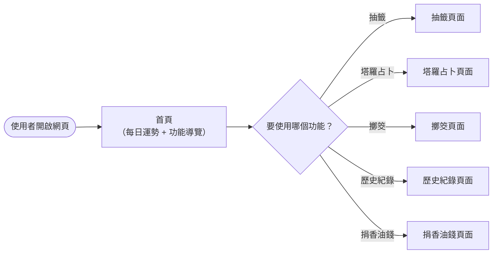

### 1.2 抽籤（求籤）流程

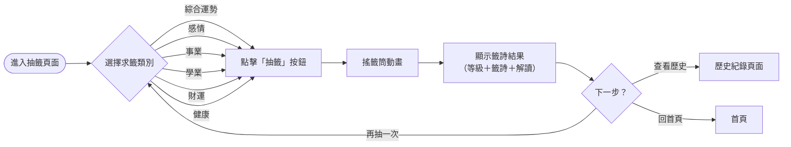

### 1.3 塔羅牌占卜流程

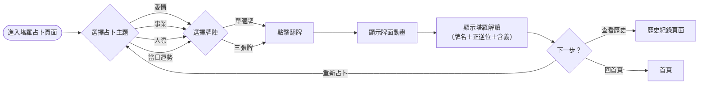

### 1.4 擲筊流程

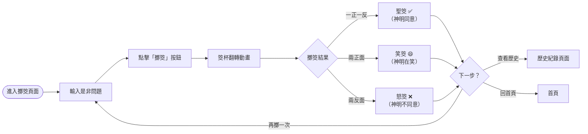

### 1.5 歷史紀錄流程

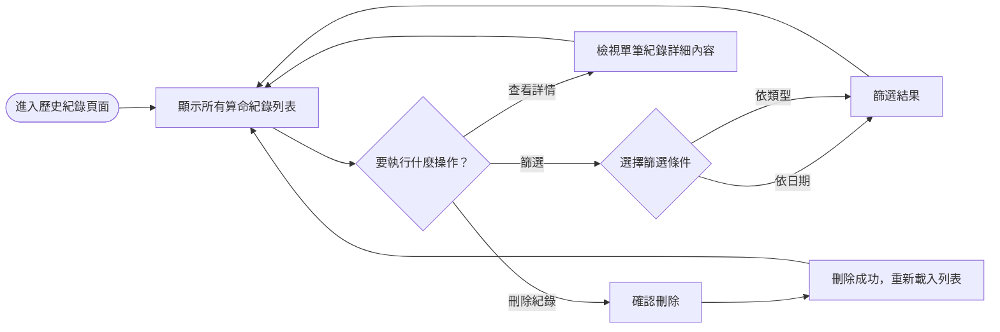

### 1.6 捐香油錢流程

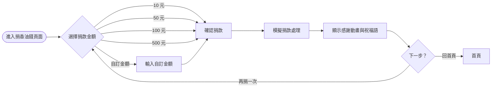

---

## 2. 系統序列圖（Sequence Diagram）

> 描述使用者操作時，資料在「瀏覽器 → Flask Route → Model → SQLite」之間的完整流動過程。

### 2.1 抽籤序列圖

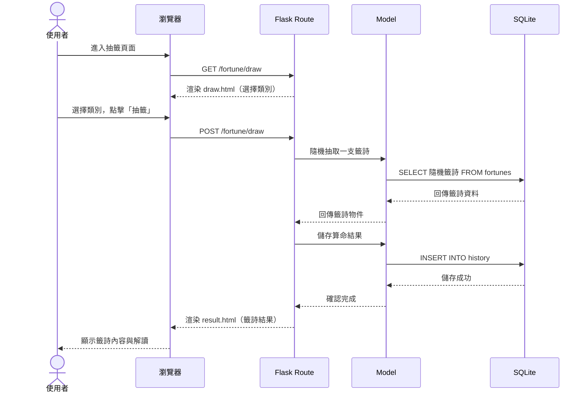

### 2.2 塔羅牌占卜序列圖

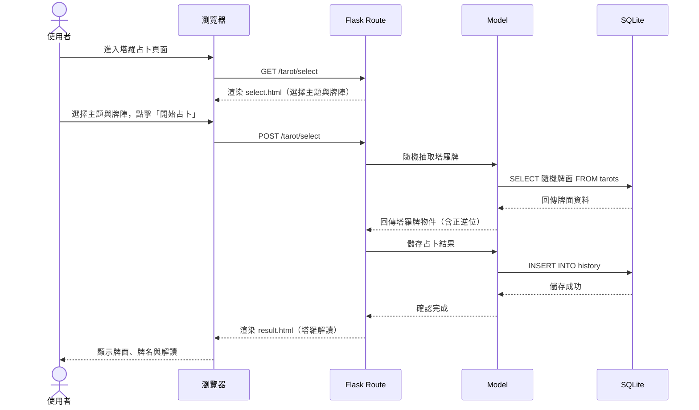

### 2.3 擲筊序列圖

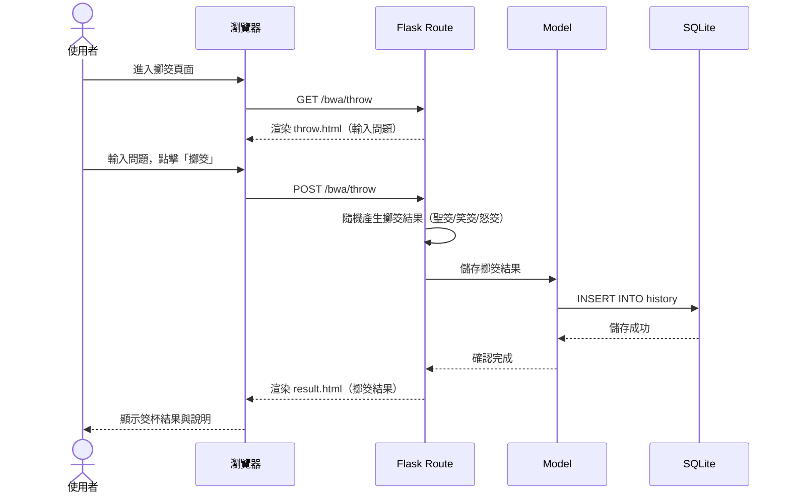

### 2.4 查看歷史紀錄序列圖

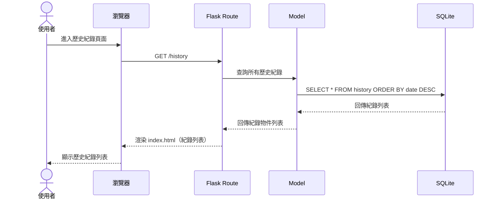

### 2.5 刪除歷史紀錄序列圖

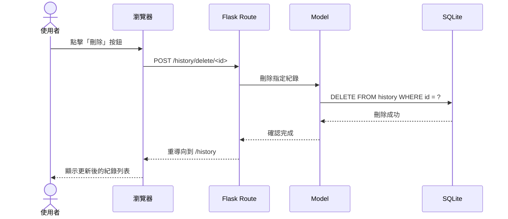

### 2.6 捐香油錢序列圖

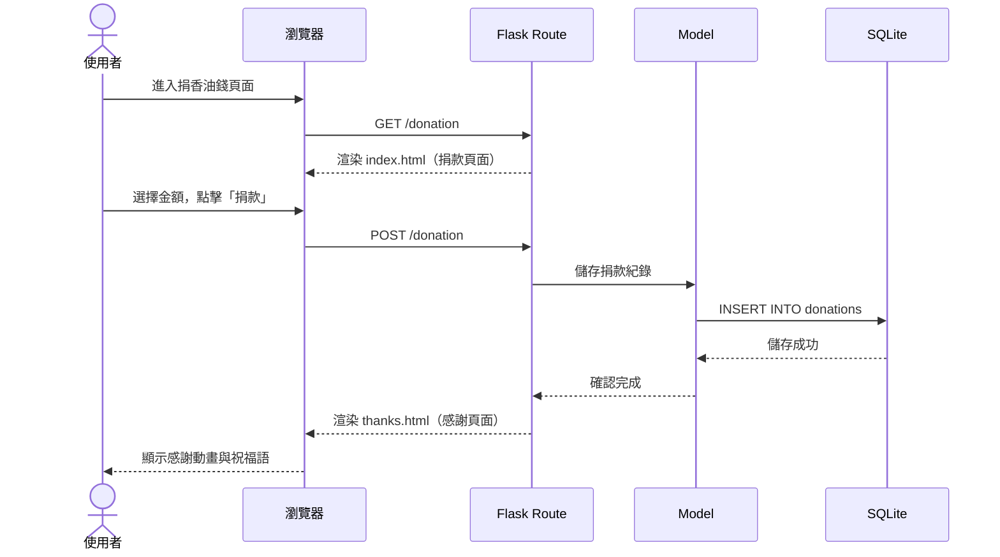

---

## 3. 功能清單對照表

> 列出系統中每個功能對應的 URL 路徑、HTTP 方法與說明。

### 3.1 首頁與每日運勢（main_bp）

| 功能 | URL 路徑 | HTTP 方法 | 說明 |
|------|----------|-----------|------|
| 首頁 | `/` | GET | 顯示每日運勢 + 算命方式導覽卡片 |

### 3.2 抽籤功能（fortune_bp）

| 功能 | URL 路徑 | HTTP 方法 | 說明 |
|------|----------|-----------|------|
| 抽籤頁面 | `/fortune/draw` | GET | 顯示選擇類別頁面 |
| 執行抽籤 | `/fortune/draw` | POST | 隨機抽籤、儲存結果、顯示籤詩 |

### 3.3 塔羅占卜功能（tarot_bp）

| 功能 | URL 路徑 | HTTP 方法 | 說明 |
|------|----------|-----------|------|
| 選擇主題與牌陣 | `/tarot/select` | GET | 顯示主題與牌陣選擇頁面 |
| 執行占卜 | `/tarot/select` | POST | 隨機抽牌、儲存結果、顯示解讀 |

### 3.4 擲筊功能（bwa_bp）

| 功能 | URL 路徑 | HTTP 方法 | 說明 |
|------|----------|-----------|------|
| 擲筊頁面 | `/bwa/throw` | GET | 顯示輸入問題頁面 |
| 執行擲筊 | `/bwa/throw` | POST | 隨機擲筊、儲存結果、顯示結果 |

### 3.5 歷史紀錄功能（history_bp）

| 功能 | URL 路徑 | HTTP 方法 | 說明 |
|------|----------|-----------|------|
| 歷史紀錄列表 | `/history` | GET | 顯示所有算命紀錄（支援篩選） |
| 刪除紀錄 | `/history/delete/<id>` | POST | 刪除指定的歷史紀錄 |

### 3.6 捐香油錢功能（donation_bp）

| 功能 | URL 路徑 | HTTP 方法 | 說明 |
|------|----------|-----------|------|
| 捐款頁面 | `/donation` | GET | 顯示香油錢捐款頁面 |
| 執行捐款 | `/donation` | POST | 模擬捐款、儲存紀錄、顯示感謝 |

---

> 📌 **下一步：** 流程圖確認無誤後，進入 **階段四：資料庫設計**（使用 `/db-design` skill）。
